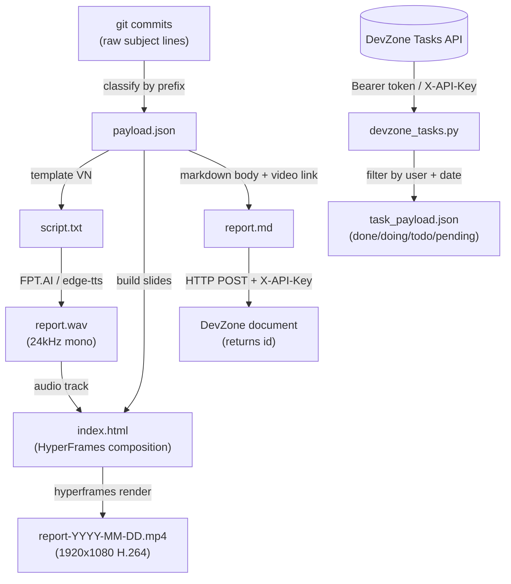
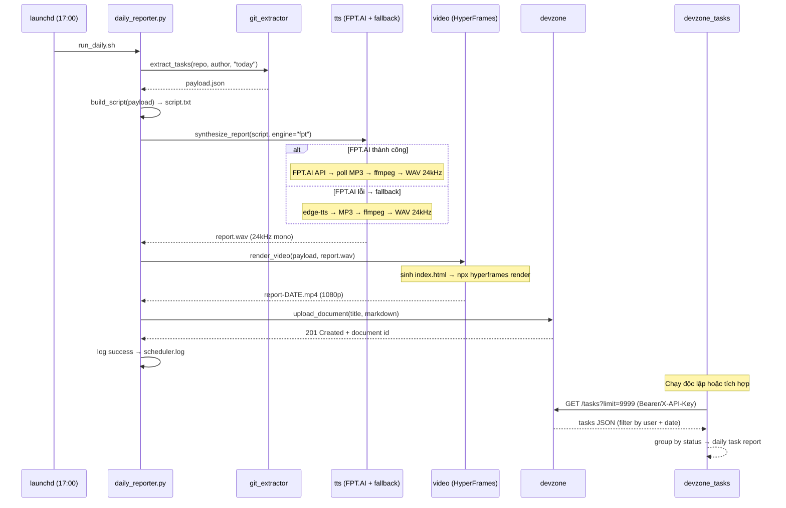
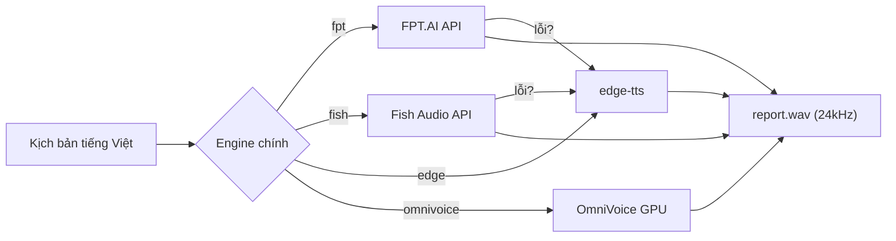
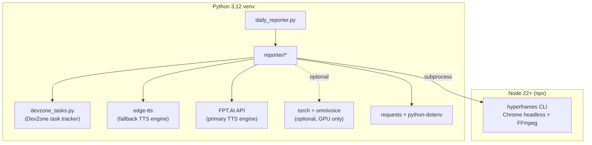

# Architecture & Workflow — Daily Video Reporter

> High-level technical overview for AI / Software Engineers.
> Tất cả sơ đồ là Mermaid — mở trên GitHub hoặc VS Code (Markdown Preview) để xem hình.

---

## 1. Tổng quan hệ thống (System Overview)

Một pipeline tự động: **đọc git commit trong ngày → kể lại bằng giọng nói tiếng Việt
(FPT.AI / edge-tts neural voice) → render thành video slide → đăng lên DevZone**, chạy tự động lúc 17:00.

Ngoài ra, module `devzone_tasks.py` kết nối **DevZone ERP API** để theo dõi tiến độ
task hàng ngày (done/doing/todo/pending) — bổ sung thêm ngữ cảnh cho báo cáo.

```mermaid
flowchart LR
    subgraph TRIGGER["⏰ Scheduler (Story 1.6)"]
        CRON["launchd / cron<br/>17:00 hằng ngày"]
    end

    subgraph PIPELINE["🐍 daily_reporter.py (Orchestrator)"]
        direction TB
        S2["1.2 Git Extractor<br/>git log → JSON"]
        S3A["1.3 Script Builder<br/>JSON → kịch bản VN"]
        S3B["1.3 TTS<br/>kịch bản → report.wav"]
        S4["1.4 Video / HyperFrames<br/>HTML → report.mp4 (1080p)"]
        S5["1.5 DevZone Client<br/>Markdown → POST document"]
        S6["DevZone Tasks<br/>API → daily task report"]
        S2 --> S3A --> S3B --> S4 --> S5
        S6 -.bổ sung.-. S5
    end

    subgraph EXT["🌐 External"]
        GIT[("Git repo<br/>commit history")]
        FPT["FPT.AI TTS<br/>(Vietnamese-optimized)"]
        EDGE["edge-tts<br/>(Microsoft Azure neural)"]
        HF["HyperFrames CLI<br/>(Node + Chrome + FFmpeg)"]
        DZ[("DevZone ERP<br/>REST API")]
    end

    CRON --> PIPELINE
    GIT -.input.-> S2
    FPT -.TTS (primary).-> S3B
    EDGE -.TTS (fallback).-> S3B
    HF -.render.-> S4
    S5 -.HTTP POST.-> DZ
    DZ -.GET tasks.-> S6
```

---

## 2. Luồng dữ liệu & hình dạng dữ liệu (Data Flow)

Mấu chốt: **đầu ra của bước này là đầu vào của bước sau**. Mọi bước đều ghi artifact
ra đĩa (`_bmad-output/temp/`) nên dễ debug từng khâu.



**`payload.json`** — "nguồn sự thật" trung tâm, mọi bước sau đều đọc từ đây:

```json
{
  "date": "2026-06-01",
  "author": "Ngọc Thiên",
  "categories": {
    "features": ["Add login validation"],
    "fixes": ["Fix button alignment"],
    "quality": ["Update README"]
  },
  "commits": ["feat: Add login validation", "fix: Fix button alignment", "..."],
  "total": 3
}
```

---

## 3. Bản đồ codebase (Codebase Map)

```
report-daily/
├── daily_reporter.py          # 🎯 ORCHESTRATOR — CLI entrypoint, nối 5 bước, log, xử lý lỗi
├── reporter/                  # 📦 Package logic nghiệp vụ (mỗi file = 1 story)
│   ├── config.py              #    Config: đọc .env + project-context.md → dataclass Config
│   ├── git_extractor.py       #    [1.2] git log → phân loại → payload.json
│   ├── script_builder.py      #    [1.3] payload → kịch bản tiếng Việt (thuần text, dễ test)
│   ├── tts.py                 #    [1.3] FPT.AI (default) + edge-tts (fallback) + Fish/OmniVoice
│   ├── video.py               #    [1.4] sinh HTML composition + gọi HyperFrames CLI
│   ├── devzone.py             #    [1.5] build Markdown + REST client (X-API-Key)
│   └── devzone_tasks.py       #    ⭐ [NEW] Lấy & lọc tasks từ DevZone API theo user + ngày
├── video/                     # 🎬 HyperFrames project (npx hyperframes init)
├── ref/                       # 🎤 Giọng tham chiếu cho OmniVoice (chỉ khi dùng omnivoice)
├── scripts/                   # 🔧 Setup & scheduling (Story 1.1 + 1.6)
├── tests/test_pipeline.py     # ✅ Unit test logic thuần (extract, script, markdown)
├── _bmad-output/              # 📂 Artifact đầu ra (gitignored)
├── project-context.md         # 📄 DevZone API spec + credentials (nguồn fallback)
├── requirements.txt / .env.example
├── README.md / HUONG-DAN-SU-DUNG.md / ARCHITECTURE.md (file này)
```

### Nguyên tắc thiết kế (Design principles)

| Nguyên tắc | Lý do |
|---|---|
| **Pure logic tách khỏi I/O** | `git_extractor`, `script_builder`, `devzone.build_markdown` là hàm thuần → unit test không cần network/ML |
| **Hai nguồn dữ liệu bổ sung nhau** | Git commit cho video narration, DevZone Tasks cho task tracking — mỗi nguồn phục vụ mục đích riêng |
| **Lazy import cho dependency nặng** | `torch`/`omnivoice` chỉ import bên trong `tts.py` khi gọi engine `omnivoice` → test & các bước khác chạy không cần GPU/model |
| **Artifact ra đĩa từng bước** | Debug được từng khâu; có thể chạy lại 1 bước mà không chạy lại cả pipeline |
| **Cờ `--skip-*` / `--dry-run`** | Cô lập từng story khi phát triển/kiểm thử |
| **Config qua env, fallback project-context.md** | Không hardcode secret; dễ trỏ sang repo/giọng/credentials khác |

---

## 4. Sequence diagram — một lần chạy (one run)



---

## 5. TTS engines

Hệ thống hỗ trợ 4 engine TTS, với cơ chế **auto-fallback** về edge-tts khi engine chính gặp lỗi.

### FPT.AI ⭐ (đang dùng — `REPORTER_TTS_ENGINE=fpt`)

- **Tối ưu cho tiếng Việt**, giọng rất tự nhiên.
- Miễn phí 100K ký tự/tháng (lấy API key tại https://console.fpt.ai).
- Giọng có sẵn: `banmai` (nữ Bắc ⭐), `leminh` (nam Bắc), `lannhi` (nữ Nam), `myan` (nữ Trung).
- Pipeline: text → POST API FPT → poll async URL → MP3 → ffmpeg → WAV 24 kHz.
- Cấu hình: `FPT_API_KEY`, `REPORTER_TTS_VOICE=banmai|leminh|lannhi|myan`.
- **Fallback:** Nếu FPT lỗi → tự động chuyển sang edge-tts.

### edge-tts (fallback / miễn phí — `REPORTER_TTS_ENGINE=edge`)

- **Free**, không cần API key, không cần GPU.
- Microsoft Azure neural voices: `vi-VN-NamMinhNeural` (male) / `vi-VN-HoaiMyNeural` (female).
- Pipeline: text → edge-tts (MP3) → ffmpeg convert → WAV 24 kHz mono.
- Cấu hình qua `REPORTER_TTS_VOICE=male|female|vi-VN-NamMinhNeural`.

### Fish Audio (optional — `REPORTER_TTS_ENGINE=fish`)

- Chất lượng cao, giọng tự nhiên. Cần nạp tiền (API credits).
- Cấu hình: `FISH_API_KEY`, `REPORTER_TTS_VOICE=<reference_id>`.
- **Fallback:** Nếu Fish lỗi → tự động chuyển sang edge-tts.

### OmniVoice (optional — `REPORTER_TTS_ENGINE=omnivoice`)

- Zero-shot voice cloning từ 1 clip mẫu + transcript.
- Yêu cầu: GPU/MPS ≥ 18 GB unified memory, `torch >= 2.8`, `omnivoice >= 0.1.5`.
- Cấu hình: `REPORTER_REF_AUDIO`, `REPORTER_REF_TEXT`, `REPORTER_TTS_DEVICE`.
- Cài thêm: `pip install torch>=2.8 torchaudio>=2.8 omnivoice>=0.1.5 soundfile>=0.12`.



---

## 6. Tech stack & ranh giới (boundaries)



- **Ranh giới ngôn ngữ:** Python orchestrate, gọi sang Node CLI qua `subprocess`
  (`reporter/video.py`). Hai bên giao tiếp qua **file** (`index.html`, `report.wav`, `.mp4`).
- **Điểm chạy chậm/nặng:** (1) HyperFrames render (Chrome headless), (2) OmniVoice load model
  (nếu dùng). FPT.AI chạy ~5–10 giây (polling), edge-tts ~3–5 giây.

---

## 7. Điểm mở rộng cho AI Engineer (Extension points)

| Muốn làm gì | Sửa ở đâu |
|---|---|
| Đổi nguồn task (vd DevZone Tasks API thay git) | `reporter/git_extractor.py` — giữ nguyên schema `payload` là các bước sau không đổi |
| Thêm/đổi cách phân loại commit | `_PREFIX_MAP` trong `git_extractor.py` |
| Đổi văn phong/ngôn ngữ kịch bản | `reporter/script_builder.py` (`build_script`) |
| Đổi TTS engine / giọng đọc | `reporter/tts.py` + `.env` (`REPORTER_TTS_ENGINE`, `REPORTER_TTS_VOICE`) |
| Đổi thiết kế slide / thêm slide | `reporter/video.py` (`build_composition_html`) |
| Đổi định dạng tài liệu DevZone | `reporter/devzone.py` (`build_markdown`) |
| Tùy chỉnh lọc/nhóm DevZone Tasks | `reporter/devzone_tasks.py` (`filter_today_tasks`, `STATUS_ORDER`) |
| Thêm bước mới vào pipeline | `daily_reporter.py` (`run()`) |

**Hợp đồng dữ liệu cần giữ (data contract):** miễn là một bước vẫn nhận/đẻ ra đúng
`payload` (mục 2) hoặc đúng đường file (`config.audio_path`, `config.video_path`),
bạn có thể thay thế hoàn toàn phần triển khai bên trong mà không ảnh hưởng bước khác.
