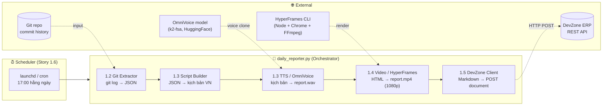
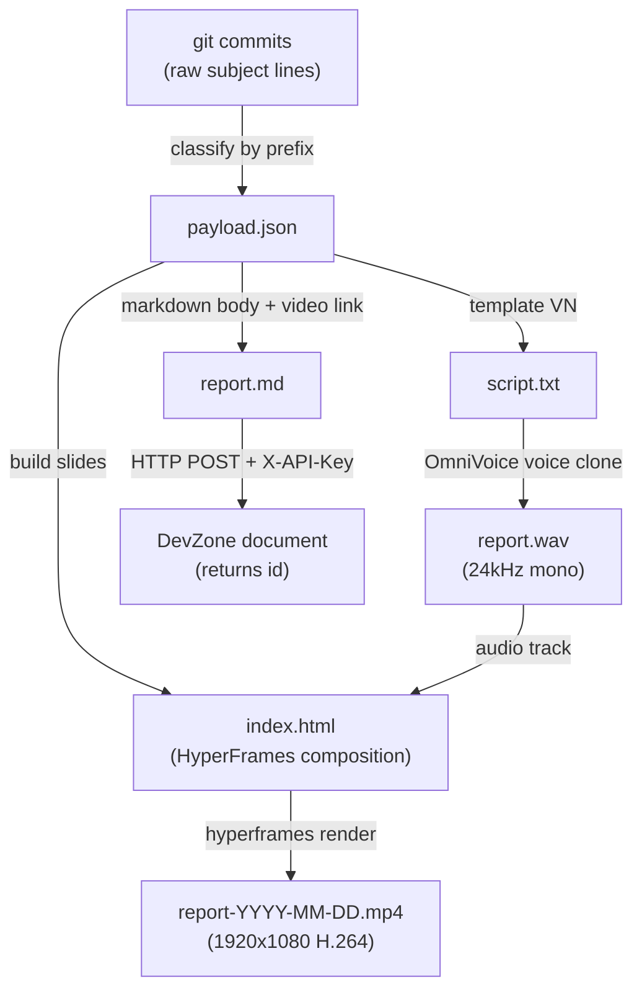
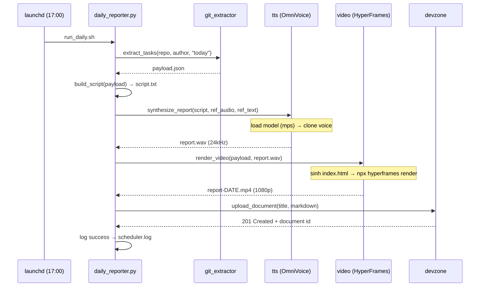
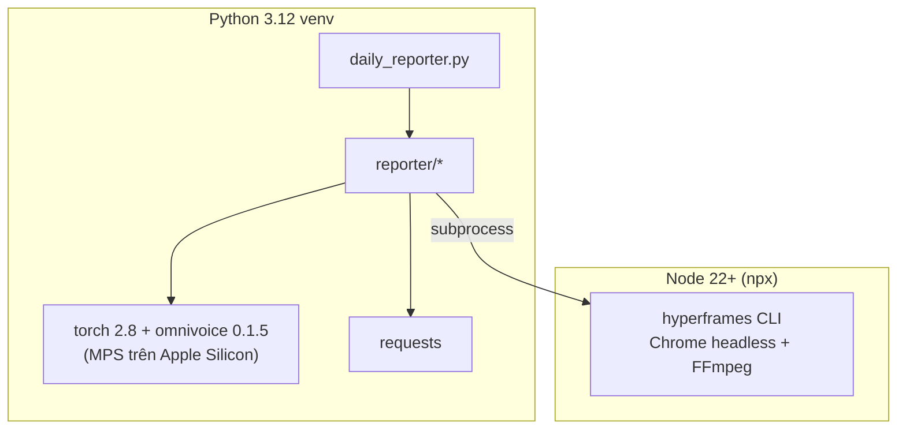

# Architecture & Workflow — Daily Video Reporter

> High-level technical overview for AI / Software Engineers.
> Tất cả sơ đồ là Mermaid — mở trên GitHub hoặc VS Code (Markdown Preview) để xem hình.

---

## 1. Tổng quan hệ thống (System Overview)

Một pipeline tự động: **đọc git commit trong ngày → kể lại bằng giọng nói tiếng Việt
(cloned voice) → render thành video slide → đăng lên DevZone**, chạy tự động lúc 17:00.



---

## 2. Luồng dữ liệu & hình dạng dữ liệu (Data Flow)

Mấu chốt: **đầu ra của bước này là đầu vào của bước sau**. Mọi bước đều ghi artifact
ra đĩa (`_bmad-output/temp/`) nên dễ debug từng khâu.



**`payload.json`** — "nguồn sự thật" trung tâm, mọi bước sau đều đọc từ đây:

```json
{
  "date": "2026-06-01",
  "author": "Thienpham",
  "categories": {
    "features": ["Add login validation"],
    "fixes": ["Fix button alignment"],
    "quality": ["Update README"]
  },
  "commits": ["feat: Add login validation", "fix: Fix button alignment", "..."],
  "total": 3
}
```

---

## 3. Bản đồ codebase (Codebase Map)

```
report-daily/
├── daily_reporter.py          # 🎯 ORCHESTRATOR — CLI entrypoint, nối 5 bước, log, xử lý lỗi
├── reporter/                  # 📦 Package logic nghiệp vụ (mỗi file = 1 story)
│   ├── config.py              #    Config: đọc .env + project-context.md → dataclass Config
│   ├── git_extractor.py       #    [1.2] git log → phân loại → payload.json
│   ├── script_builder.py      #    [1.3] payload → kịch bản tiếng Việt (thuần text, dễ test)
│   ├── tts.py                 #    [1.3] OmniVoice wrapper → report.wav (import nặng = lazy)
│   ├── video.py               #    [1.4] sinh HTML composition + gọi HyperFrames CLI
│   └── devzone.py             #    [1.5] build Markdown + REST client (X-API-Key)
├── video/                     # 🎬 HyperFrames project (npx hyperframes init)
│   ├── index.html             #    Composition được GHI LẠI mỗi lần render (do video.py sinh)
│   └── assets/report.wav      #    Audio được copy vào đây để render
├── ref/                       # 🎤 Giọng tham chiếu cho voice cloning
│   ├── reference.wav          #    (đổi file này = đổi giọng đọc)
│   └── reference.txt          #    transcript của clip trên
├── scripts/                   # 🔧 Setup & scheduling (Story 1.1 + 1.6)
│   ├── setup.sh               #    Cài ffmpeg, venv, torch+omnivoice, hyperframes
│   ├── make_reference.sh      #    Tạo clip giọng mẫu (placeholder)
│   ├── run_daily.sh           #    Wrapper scheduler gọi (load .env, kích hoạt venv)
│   ├── install_scheduler.sh   #    Cài launchd agent
│   └── com.vietnix.dailyreporter.plist   # launchd config (17:00)
├── tests/test_pipeline.py     # ✅ Unit test logic thuần (extract, script, markdown)
├── _bmad-output/              # 📂 Artifact đầu ra (gitignored)
│   ├── temp/                  #    payload.json, script.txt, report.wav, report.md
│   ├── videos/                #    report-YYYY-MM-DD.mp4
│   └── logs/scheduler.log     #    nhật ký chạy
├── project-context.md         # 📄 DevZone API spec + credentials (nguồn fallback)
├── requirements.txt / .env.example
├── README.md / HUONG-DAN-SU-DUNG.md / ARCHITECTURE.md (file này)
```

### Nguyên tắc thiết kế (Design principles)

| Nguyên tắc | Lý do |
|---|---|
| **Pure logic tách khỏi I/O** | `git_extractor`, `script_builder`, `devzone.build_markdown` là hàm thuần → unit test không cần network/ML |
| **Lazy import cho dependency nặng** | `torch`/`omnivoice` chỉ import bên trong `tts.py` khi gọi → test & các bước khác chạy không cần GPU/model |
| **Artifact ra đĩa từng bước** | Debug được từng khâu; có thể chạy lại 1 bước mà không chạy lại cả pipeline |
| **Cờ `--skip-*` / `--dry-run`** | Cô lập từng story khi phát triển/kiểm thử |
| **Config qua env, fallback project-context.md** | Không hardcode secret; dễ trỏ sang repo/giọng/credentials khác |

---

## 4. Sequence diagram — một lần chạy (one run)



---

## 5. Tech stack & ranh giới (boundaries)



- **Ranh giới ngôn ngữ:** Python orchestrate, gọi sang Node CLI qua `subprocess`
  (`reporter/video.py`). Hai bên giao tiếp qua **file** (`index.html`, `report.wav`, `.mp4`).
- **Điểm chạy chậm/nặng:** (1) tải & load model OmniVoice, (2) HyperFrames render (Chrome).
  Cả hai đều idempotent và cache lại (model ở `~/.cache/huggingface`, Chrome ở `~/.cache/hyperframes`).

---

## 6. Điểm mở rộng cho AI Engineer (Extension points)

| Muốn làm gì | Sửa ở đâu |
|---|---|
| Đổi nguồn task (vd DevZone Tasks API thay git) | `reporter/git_extractor.py` — giữ nguyên schema `payload` là các bước sau không đổi |
| Thêm/đổi cách phân loại commit | `_PREFIX_MAP` trong `git_extractor.py` |
| Đổi văn phong/ngôn ngữ kịch bản | `reporter/script_builder.py` (`build_script`) |
| Đổi model TTS / tham số giọng | `reporter/tts.py` (`OmniVoiceTTS`) |
| Đổi thiết kế slide / thêm slide | `reporter/video.py` (`build_composition_html`) |
| Đổi định dạng tài liệu DevZone | `reporter/devzone.py` (`build_markdown`) |
| Thêm bước mới vào pipeline | `daily_reporter.py` (`run()`) |

**Hợp đồng dữ liệu cần giữ (data contract):** miễn là một bước vẫn nhận/đẻ ra đúng
`payload` (mục 2) hoặc đúng đường file (`config.audio_path`, `config.video_path`),
bạn có thể thay thế hoàn toàn phần triển khai bên trong mà không ảnh hưởng bước khác.
```
